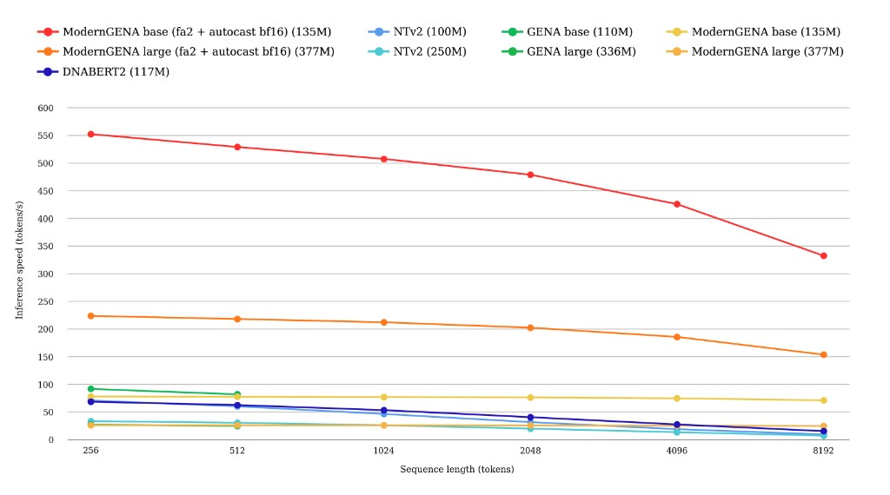
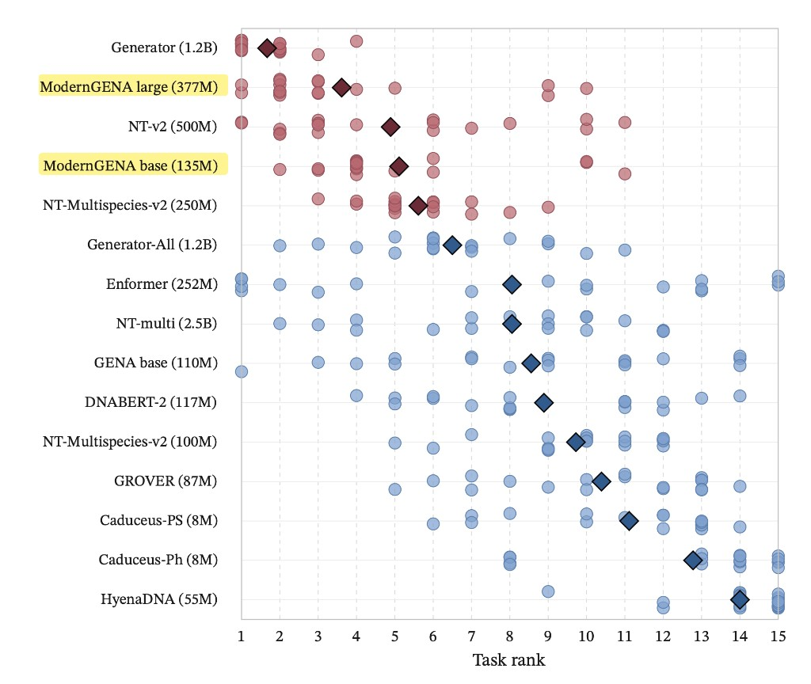

# modernGENA

ModernGENA is a DNA foundation model family based on a ModernBERT-style encoder adapted for genomic sequence modeling.

We are releasing __modernGENA__ [base](https://huggingface.co/AIRI-Institute/moderngena-base) and [large](https://huggingface.co/AIRI-Institute/moderngena-large), designed to be faster and more efficient that our [previous generation](./README_previous_generation.md) of GENA models

Start from our [modernGENA examples](./examples/modernGENA) and see the paper [Back to BERT in 2026: ModernGENA as a Strong, Efficient Baseline for DNA Foundation Models](https://openreview.net/forum?id=8QsSDzYK97).

### Pre-trained models

| Model | Hugging Face |
| --- | --- |
| modernGENA base | [AIRI-Institute/moderngena-base](https://huggingface.co/AIRI-Institute/moderngena-base) |
| modernGENA large | [AIRI-Institute/moderngena-large](https://huggingface.co/AIRI-Institute/moderngena-large) |

### Technical features

- ModernBERT-based encoder architecture
- Regulatory and coding regions upsampling during pretraining
- Hybrid local/global attention
- RoPE positional embeddings
- End-to-end unpadding
- FlashAttention-based efficient inference on compatible hardware
- Same [32k BPE tokenizer](data/tokenizers/t2t_1000h_multi_32k) as GENA-LM for straightforward transition from previous GENA workflows

### Pretraining corpus

- 443 vertebrate genome assemblies
- 353,574,093,776 bp total
- Includes both forward strand and reverse complement sequences
- Excludes sequences containing ambiguous symbols other than `A/C/G/T`
- Sampling window: `[-16 kbp, +8 kbp]` around each unique TSS
- Overlapping intervals merged with BEDTools, both strands included

### Benchmarking



Inference efficiency on an NVIDIA A100 (80 GB). Models from the primary baseline set are benchmarked. Throughput is averaged over 10 timing runs per model.



ModernGENA improves downstream performance on NT bench and leads among comparable-size models. Circles denote task-specific ranks, while diamonds indicate the average rank across tasks.

## Quick start

### Load a pretrained model

```python
import importlib.util
from transformers import AutoTokenizer, AutoModel

model_kwargs = {"trust_remote_code": True}
if importlib.util.find_spec("flash_attn") is not None:
    model_kwargs["attn_implementation"] = "flash_attention_2"

tokenizer = AutoTokenizer.from_pretrained("AIRI-Institute/moderngena-base", **model_kwargs)
model = AutoModel.from_pretrained("AIRI-Institute/moderngena-base", **model_kwargs)
```

Swap the model name to `AIRI-Institute/moderngena-large` to use modernGENA large.

### Run training examples

See [examples/modernGENA](./examples/modernGENA) for:
- sequence classification (`sequence_classification/`)
- token regression (`token_regression/`)

From the repository root:

```bash
conda env create -f examples/modernGENA/environment.yml
conda activate moderngena-example
bash examples/modernGENA/sequence_classification/download_and_prepare_data.sh
python examples/modernGENA/sequence_classification/train.py
```

## Citation

- ModernGENA: [Back to BERT in 2026: ModernGENA as a Strong, Efficient Baseline for DNA Foundation Models](https://openreview.net/forum?id=8QsSDzYK97)

- original GENA paper:

```
@article{GENA_LM,
    author = {Fishman, Veniamin and Kuratov, Yuri and Shmelev, Aleksei and Petrov, Maxim and Penzar, Dmitry and Shepelin, Denis and Chekanov, Nikolay and Kardymon, Olga and Burtsev, Mikhail},
    title = {GENA-LM: a family of open-source foundational DNA language models for long sequences},
    journal = {Nucleic Acids Research},
    volume = {53},
    number = {2},
    pages = {gkae1310},
    year = {2025},
    month = {01},
    issn = {0305-1048},
    doi = {10.1093/nar/gkae1310},
    url = {https://doi.org/10.1093/nar/gkae1310},
    eprint = {https://academic.oup.com/nar/article-pdf/53/2/gkae1310/61443229/gkae1310.pdf},
}
```
