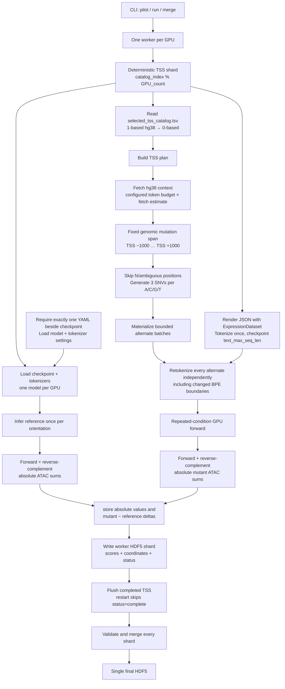

# TSS Saturation Mutagenesis: Code Review Guide

The fastest review is to inspect the four correctness-critical areas first:

1. Biological and coordinate semantics
2. Variant construction and BPE retokenization
3. Inference and scoring
4. HDF5 storage and restart behavior

Multi-GPU orchestration and CLI plumbing can be reviewed afterward.

## Execution graph



## Per-TSS execution stack

```text
TSS catalog row
  │
  ├─ chromosome, 1-based TSS, strand
  │
  ▼
hg38 sequence context and fixed mutation interval
  │
  ├─ [TSS−1000, TSS+1001): 2,001 candidate bases
  ├─ forward inference: genomic + orientation
  └─ reverse-complement inference: genomic − orientation
  │
  ▼
Model BPE tokenization per orientation
  │
  ├─ upstream tokens = num_before
  ├─ downstream tokens = DNA input length − 2 − num_before
  ├─ gap token "-" maps to the complete source N-run
  └─ BPE boundaries do not define the mutation interval
  │
  ▼
Mutable reference positions
  │
  ├─ A → C, G, T
  ├─ C → A, G, T
  ├─ G → A, C, T
  ├─ T → A, C, G
  └─ N/other → no variants, position gap retained
  │
  ▼
Reference inference once per orientation
  │
  ├─ forward absolute ATAC sum
  ├─ reverse-complement absolute ATAC sum
  └─ both use [TSS−500, TSS+501)
  │
  ▼
Alternate batches
  │
  ├─ construct alternate DNA
  ├─ independently retokenize around TSS
  ├─ predict forward and reverse-complement ATAC
  ├─ retain both absolute mutant sums
  └─ calculate each mutant sum − matching reference sum
  │
  ▼
Float32 absolute_mutant[mutable_position, 3, 2]
Float32 delta[mutable_position, 3, 2]
```

## 1. Biological and coordinate semantics

Start with `create_sequence_plan()` in `saturation_mutagenesis.py`.

Check:

- Is `tss_position_1based - 1` the intended coordinate conversion?
- Is transcript-oriented handling correct for minus-strand TSSs?
- Is the fixed `[TSS−1000, TSS+1001)` mutation interval correct?
- Should `N` bases be skipped rather than mutated?
- Should genomic alleles be stored in reference-genome orientation? This is the current behavior.

Then inspect `CenteredTokenizer.tokenize()` in
`api/src/gena_expression/inference/tokenization.py`.

The essential gap-token rule is:

```text
tokenizer: NNNNNNNNNNNN → "-"
coordinate mapping: "-" → original 12-bp N-run
```

The preceding full-stream offset is captured before upstream token truncation.
This keeps the mapping correct when a collapsed gap token becomes the first
retained upstream token.

Runtime invariants reject:

- Non-positive token source spans
- Token mappings extending outside the source sequence
- Gap token `5` mappings that do not cover a nonempty, exact `N` run

## 2. Variant construction and BPE retokenization

Review `mutation_batches()` in `saturation_mutagenesis.py`.

For every mutable genomic position, it:

- Reads the reference nucleotide directly from the source sequence.
- Generates the other three bases in lexicographic order.
- Constructs a new alternate `AnnotatedSequence`.
- Preserves the TSS feature and genomic coordinate map.
- Does not reuse the reference tokenization.

Every alternate allele is tokenized independently, so mutations may change BPE
boundaries without reusing stale reference-token coordinates.

`N` and other ambiguous bases do not produce variants. The explicit
`position_offset` array preserves coordinate gaps created by skipped bases.

## 3. Inference and scoring

The main numerical path is `score_plan()` in `saturation_mutagenesis.py`.

```text
reference sequence ── infer once ── reference ATAC sum
                                           │
alternate sequences ─ batched inference ───┼─ alt − ref
                                           │
                                      float32 score
```

Important behavior:

- Before model loading, exactly one `*.yaml` must exist beside the checkpoint.
- That YAML directly supplies `model_kwargs`, model class, DNA and description
  tokenizers, model input length, and `text_max_seq_len`.
- `inference_config.yaml` supplies the default checkpoint path and the
  inference-specific base-pair scoring radius; it does not duplicate
  training/model parameters.
- The reference is evaluated once in each orientation per TSS.
- Alternatives are grouped under one cached description.
- The description uses the exact `ExpressionDataset` formatter and tokenizer path.
- ATAC channel `0` is selected.
- Aggregation is base-pair weighted rather than a raw token sum.
- With `score_window_bp: 500`, the score window is `[TSS−500, TSS+501)`,
  exactly 1,001 bp.
- Absolute reference and mutant sums are retained for both orientations.
- The stored delta sign is `alternative − reference` for each orientation.
- Prediction objects are released after scalar extraction.

The optimized path was smoke-tested on a minus-strand TSS using the real v1-1
checkpoint. Three alternate alleles produced finite ATAC deltas while the
description cache remained at one entry.

## 4. HDF5 format and restart behavior

Review `initialize_shard()` and `merge_shards()` in
`saturation_mutagenesis.py`.

| Dataset | Meaning |
|---|---|
| `/scores[N,3,2]` | Three alternatives × forward/reverse-complement float32 deltas per mutable base |
| `/variant_atac_sum[N,3,2]` | Absolute mutant ATAC sums for both orientations |
| `/ref_base[N]` | Reference nucleotide encoded as `A=0,C=1,G=2,T=3` |
| `/position_offset[N]` | Genomic offset within the reference-visible interval |
| `/tss/offsets` | Maps each TSS to its flat score rows |
| `/tss/status` | Pending, complete, or failed |
| `/tss/reference_atac_sum[TSS,2]` | Absolute forward and reverse-complement reference ATAC sums |
| `/provenance` | Input, model, tokenizer, description, and scoring settings and hashes |

Provenance includes both the checkpoint `.bin` and checkpoint-local YAML paths
and SHA-256 hashes. This prevents shards produced from differently configured
checkpoints from being merged.

If an interval is `ACNTA`, the mutable position offsets remain `0,1,3,4`.
Skipping `N` therefore does not silently close the genomic coordinate gap.

A TSS is marked complete only after its scores and reference value are written.
The merge rejects:

- Missing shards
- Incomplete or failed TSSs
- Duplicate TSS IDs
- Incompatible catalog, model, tokenizer, or description provenance
- An unexpected total TSS count

## 5. Multi-GPU orchestration

Review `launch()` in `run_saturation_mutagenesis.py` and `run_worker()` in
`saturation_mutagenesis.py`.

TSS assignment is deterministic:

```python
catalog_index % shard_count == shard_index
```

Each process:

- Owns one GPU.
- Loads one model.
- Writes one HDF5 shard.
- Never writes another worker's shard.
- Skips completed TSSs when restarted.

## Recommended review order

For the highest-value review in the least time:

1. `create_sequence_plan()` — coordinate and strand correctness
2. `CenteredTokenizer.tokenize()` — BPE and collapsed-N mapping
3. `mutation_batches()` — allele generation and independent retokenization
4. `score_plan()` — reference caching and ATAC effect definition
5. `initialize_shard()` and `merge_shards()` — durability and data layout
6. `run_worker()` and `launch()` — GPU process orchestration
7. `test_saturation_mutagenesis.py` — regression coverage

## Review questions

1. Is the fixed 2,001-bp mutation interval correct?
2. Should mutation alleles be reported in genomic orientation, as implemented?
3. Is the 1,001-bp ATAC window exactly what is intended?
4. Is ATAC channel `0` definitely the desired model output?
5. Is absolute sum difference preferable to mean or normalized difference?
6. Is skipping `N` correct, or should affected TSSs be excluded entirely?
7. Are separate forward and reverse-complement absolute values the desired orientation representation?
8. Is the compact three-alternative HDF5 representation convenient for downstream analysis?
9. Does every deployed checkpoint directory contain exactly one matching YAML?

## Validation completed

- Eight focused unit and regression tests pass.
- Checkpoint-local YAML cardinality and model-kwargs compatibility are tested.
- Plus- and minus-strand BPE windows were checked.
- A selected leading gap token representing 12 `N` bases maps to all 12 source bases.
- The v1-1 checkpoint and restored inference configuration load successfully.
- A real minus-strand reference/three-SNV inference smoke test produced finite scores.
