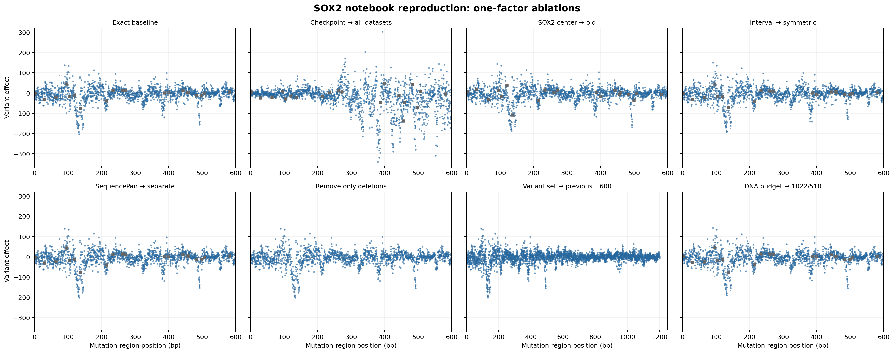

# SOX2 notebook-reproduction ablations

These experiments revert one component at a time from the exact notebook
reproduction. All other settings remain at the exact-reproduction baseline.
The baseline is documented in
[`SOX2_reproducibility.md`](../SOX2_reproducibility.md) and stored in
[`sox2_dev_loss_h1_notebook_exact_output`](../sox2_dev_loss_h1_notebook_exact_output/).

## What changed

The five items proposed for ablation were not quite the complete list. The DNA
input budget also changed from the earlier `dna_input_seq_len=1022,
num_before=510` to the notebook's `1024, 511`, so it is included as a sixth
model/input ablation. The H1 description and variant-centered 501-bp scorer
were already used in the immediately preceding solution and are therefore not
ablated.

The exact baseline uses `dev_loss`, the corrected 0-based TSS 181711924, the
notebook interval `[181701704,181714436)`, joint `SequencePair` inference,
1024/511 DNA token settings, 1,800 upstream substitutions, and 20 deletions.

| Reverted component | Fallback setting | SNVs | Deletions | Shared upstream profile correlation | Strongest SNV | Picture |
|---|---|---:|---:|---:|---|---|
| None (exact baseline) | Exact notebook reproduction | 1,800 | 20 | 1.000 | -202.13 at 133 | [PNG](../sox2_dev_loss_h1_notebook_exact_output/sox2_notebook_reproduction_track_window.png) |
| Model checkpoint | `all_datasets` / `model_270526` | 1,800 | 20 | 0.207 | -339.73 at 380 | [PNG](model_checkpoint_all_datasets/sox2_notebook_reproduction_track_window.png) |
| SOX2 center | Old 0-based center 181711923 | 1,800 | 20 | 0.689 | -186.02 at 134 | [PNG](old_sox2_center/sox2_notebook_reproduction_track_window.png) |
| Sequence interval | Previous symmetric interval `[181701724,181722124)` | 1,800 | 20 | 0.986 | -190.90 at 132 | [PNG](previous_symmetric_interval/sox2_notebook_reproduction_track_window.png) |
| Pair execution | Separate reference/alternative forwards | 1,800 | 20 | 0.99995 | -202.32 at 133 | [PNG](separate_sequence_pairs/sox2_notebook_reproduction_track_window.png) |
| Notebook variant set | Remove only the 20 deletions | 1,800 | 0 | 0.999999 | -202.13 at 133 | [PNG](no_deletions/sox2_notebook_reproduction_track_window.png) |
| Notebook variant set | Previous TSS -600...+600 substitutions, no deletions | 3,603 | 0 | 0.999999 | -202.13 at 133 | [PNG](previous_variant_set/sox2_notebook_reproduction_track_window.png) |
| DNA token budget | Previous 1022/510 settings | 1,800 | 20 | 0.994 | -190.81 at 133 | [PNG](previous_token_budget/sox2_notebook_reproduction_track_window.png) |

The profile correlation is the Pearson correlation between the strongest
negative SNV effect at each of the 600 shared upstream positions and the exact
baseline. This positional statistic remains meaningful for the one-base center
ablation even though its reference alleles are shifted.

## Conclusions

1. The checkpoint is the dominant cause of the match. Reverting to
   `all_datasets` moves the strongest cluster from promoter position 133 to 380,
   expands the score range, and reduces profile correlation to 0.207.
2. Correcting the SOX2 center is the second most important change. Its one-base
   shift reduces profile correlation to 0.689.
3. Exact notebook sequence bounds have a visible but modest effect (0.986).
4. The 1024/511 DNA budget also has a modest effect (0.994).
5. Joint versus separate pair execution is numerically negligible here.
6. Deletions and the larger previous mutation set do not alter the shared SNV
   pattern. They only control which additional variants are reported.

Each experiment folder contains its Parquet scores, JSON provenance, and PNG.
The JSON records the resolved checkpoint and hashes, coordinates, sequence
bounds, token settings, execution mode, variant counts, and runtime. The runs
were distributed concurrently across busy GPUs, so their elapsed times should
not be used as a controlled performance comparison.
